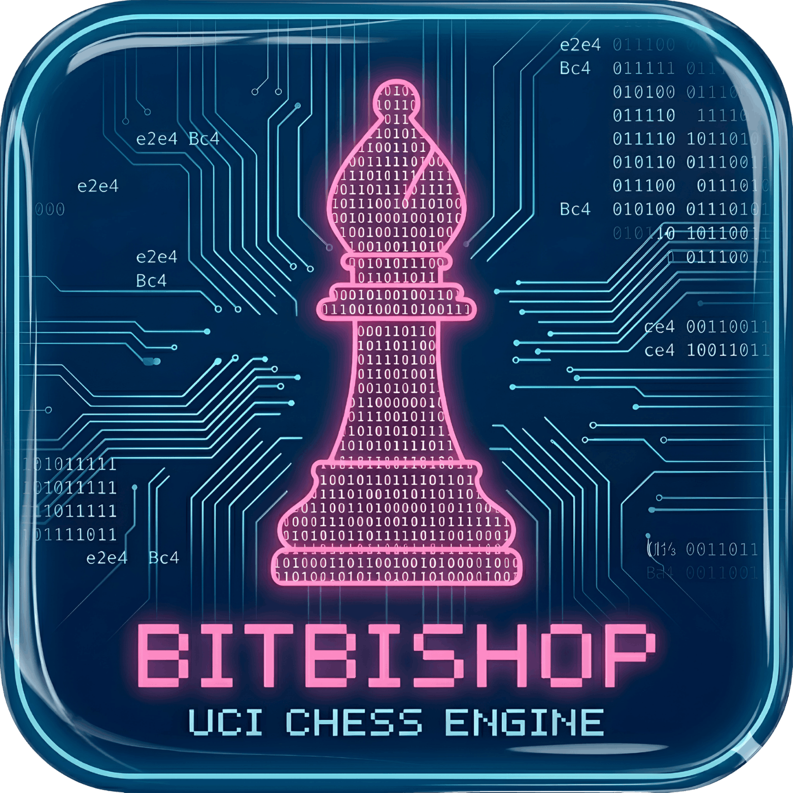

<p align="center">
  
</p>

<div align=center>
    <a href="LICENSE"></a>
</div>

<div align=center>
    <a href="https://isocpp.org"></a>
    <a href=https://cmake.org></a>
    <a href="https://vcpkg.io"></a>
</div>

<div align=center>
    <a href="https://github.com/Hardcode3/BitBishop/actions/workflows/linux_build_test.yaml"></a>
    <a href="https://github.com/Hardcode3/BitBishop/actions/workflows/windows_build_test.yaml"></a>
    <a href="https://github.com/Hardcode3/BitBishop/actions/workflows/macos_build_test.yaml"></a>
</div>

<div align=center>
    <a href="https://github.com/Hardcode3/BitBishop/actions/workflows/linux_build_test.yaml"></a>
    <a href="https://github.com/Hardcode3/BitBishop/actions/workflows/clang_tidy.yaml"></a>
</div>

<div align=center>
    <a href="https://Hardcode3.github.io/BitBishop/coverage/html/index.html"></a>
    <a href="https://Hardcode3.github.io/BitBishop/coverage/html/index.html"></a>
    <a href="https://Hardcode3.github.io/BitBishop/coverage/html/index.html"></a>
    <a href="https://Hardcode3.github.io/BitBishop/coverage/html/index.html"></a>
</div>

# BitBishop

A modern chess engine written in C++23, built as a learning project around
bitboards, move generation, search, and engine architecture.

## Overview

BitBishop is a personal project focused on learning by building a real engine.
The codebase is organized as a layered architecture with dedicated modules for
compile-time geometry, occupancy-aware attacks, legal move generation,
reversible move execution, evaluation, search, and a UCI-facing interface.

The goal is not just to "have a chess engine," but to keep the code readable,
testable, and well documented for anyone curious about chess programming or
modern C++.

## Current State

- UCI executable via `bitbishop` with `uci`, `isready`, `ucinewgame`, `position`, `go`, `stop`, and `quit`
- FEN parsing and UCI move parsing
- Legal move generation with checks, pins, castling, en passant, and promotions
- Reversible move execution with position history and Zobrist hashing
- Basic evaluation using material and piece-square tables
- Negamax search with alpha-beta pruning and quiescence search
- Perft tooling and a tiered GoogleTest suite
- CMake Presets, vcpkg integration, linting hooks, and coverage targets

BitBishop is already usable for development and basic UCI-driven experiments,
but it is still under active development. The UCI layer exists today, though
protocol coverage and search strength are not yet "finished engine" level.

## Short-Term Focus

- stronger search features and move ordering
- richer UCI support and time-control handling
- continued validation with perft and targeted tests
- ongoing documentation improvements across the codebase

## Getting Started

### Prerequisites

- CMake 3.27 or newer
- Clang on Unix-like systems, or MSVC 2022 on Windows
- vcpkg with `VCPKG_ROOT` configured
- Ninja on Unix-like systems, or Visual Studio 2022 on Windows

Optional developer tools:

- `clang-format` (code formatting)
- `clang-tidy` (code linting)
- `llvm-cov` (code coverage)
- `llvm-profdata` (code coverage)

### Build and Test

Typical Unix-like workflow:

```bash
cmake --preset clang_debug
cmake --build --preset clang_debug
ctest --preset quick-validation-clang-debug
```

Typical Windows workflow:

```powershell
cmake --preset msvc_debug
cmake --build --preset msvc_debug
ctest --preset quick-validation-msvc-debug
```

The project uses CMake Presets for configure, build, and test workflows. For
the full preset matrix, coverage targets, and packaging notes, see the
[CMake guide](./docs/cmake.md).

### Run the Engine

On Unix-like systems, the executable is typically produced under the selected
build preset directory:

```bash
./build/clang_debug/main/bitbishop
```

Minimal UCI smoke test:

```text
uci
isready
position startpos moves e2e4 e7e5
go depth 4
quit
```

For more information about available commands, see [this doc](./docs/commands.md).

## Documentation

### Project Docs

#### Guides

- [Engine commands (UCI and extensions)](./docs/commands.md)
- [Build the project with CMake](./docs/cmake.md)
- [Run CI on GitHub](./docs/ci.md)
- [Internal architecture](./include/bitbishop/readme.md)
- [Debug with perft](./docs/debug_perft.md)

#### Memos

- [FEN notation memo](./docs/fen_notation.md)
- [UCI protocol memo](./docs/uci_protocol.md)

### External References

- [Andrew Healey - Building My Own Chess Engine](https://healeycodes.com/building-my-own-chess-engine)
- [Chess Programming Wiki](https://www.chessprogramming.org/Getting_Started)
- [UCI overview on Chessprogramming](https://www.chessprogramming.org/UCI)

## Project Structure

```text
BitBishop/
├── build/                       # Build artifacts
├── cmake/                       # CMake helper scripts
├── docs/                        # Documentation and guides
├── include/bitbishop/           # Public headers and architecture docs
├── main/                        # Executable entrypoints
├── src/bitbishop/               # Library sources
├── tests/bitbishop/             # Unit and validation tests
├── CMakeLists.txt               # Build configuration
├── CMakePresets.json            # Preset-based workflows
├── vcpkg.json                   # Dependency manifest
└── ...
```

For a more detailed view of the engine layers, see
[include/bitbishop/readme.md](./include/bitbishop/readme.md).

## Design Goals

- Learn and demonstrate low-level C++ techniques through a real project
- Keep the architecture explicit and easy to navigate
- Maintain strong test feedback with tiered validation
- Document the reasoning behind the implementation, not just the APIs

## Contributing

This is primarily a personal learning project, but suggestions and constructive
feedback are welcome.

Before opening a pull request, please read:

- [CONTRIBUTING.md](./CONTRIBUTING.md)
- [CODE_OF_CONDUCT.md](./CODE_OF_CONDUCT.md)
- [SECURITY.md](./SECURITY.md)

Feel free to:

- Open issues for bugs or suggestions
- Submit pull requests with improvements
- Share your own learning experiences

> [!NOTE]
> This is a personal project for now. Community documentation has been written in case one day, someone wants to contribute.

## Status

BitBishop is functional enough for development, experimentation, and basic
UCI-based testing, but it is still an in-progress engine rather than a polished
competitive one.

## License

- [MIT License](./LICENSE)

## Acknowledgments

This project draws heavily from the chess programming community and the many
people who document engine design in public.

---

**Repository**: [github.com/Hardcode3/BitBishop](https://github.com/Hardcode3/BitBishop)
