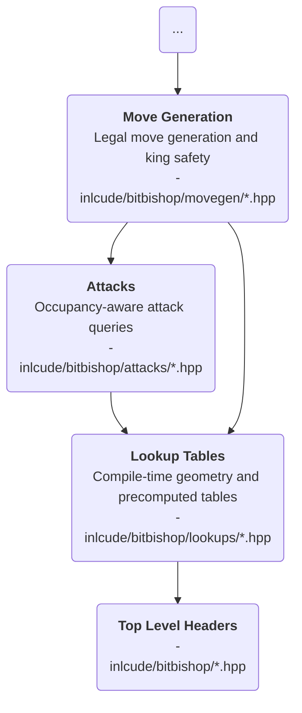

# About the `attacks/` directory

## Purpose

`attacks/` contains **occupancy-aware attack queries**.

This layer **starts from a current position** or an `occupied` bitboard and answers
questions such as:

- **what squares does this slider attack?**
- **which enemy pieces are currently checking the king?**
- **which squares are attacked by one side in the current position?**

## Place in the architecture

## Responsibilities

- Combine **geometric patterns with runtime occupancy**
- Compute **exact slider attacks in the current position**
- Detect **checking pieces** and aggregate attacked squares
- Provide **precise attack** information to the rules layer

## Inputs

- Immutable geometry from `lookups/`
- Runtime occupancy from `Board`
- Core types such as `Bitboard`, `Square`, and `Color`

## Outputs

- Exact attack bitboards for sliding pieces
- Checker sets and attacked-square maps
- Occupancy-aware answers consumed by `movegen/`
