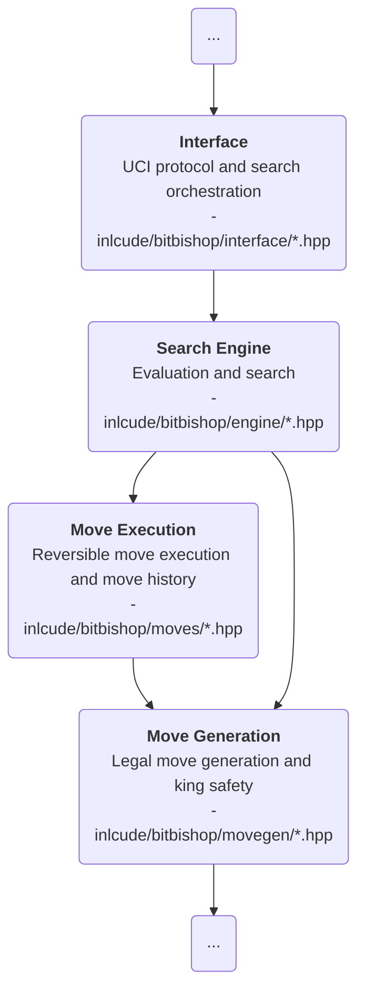

# About the `engine/` directory

## Purpose

`engine/` **explores and ranks best moves** once legal moves already exist.

This layer **evaluates positions**, **searches the game tree**, and **returns the best
move it can find**.

## Place in the architecture

## Responsibilities

- **Evaluate positions**
- **Search the game tree**
- **Choose the best move available within the current limits**

## Inputs

- `movegen/` for legal moves
- `moves/` for apply/revert history during search
- `Board` and evaluation data from the core headers

## Outputs

- Best-move decisions
- Scores used by the protocol layer or analysis tools
