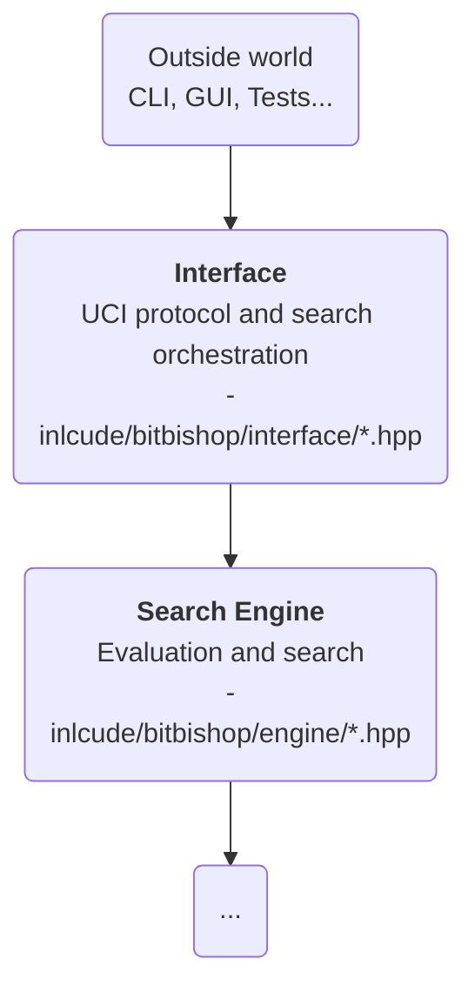

# About the `interface/` directory

## Purpose

`interface/` is the **boundary between BitBishop and the outside world**.

In the current codebase this directory is **primarily the UCI layer**. It parses
commands, owns the session loop, translates time controls into search limits,
and reports results back to the caller.

## Place in the architecture

## Responsibilities

- **Parse external commands** and inputs
- **Translate protocol concepts into engine calls**
- **Manage search sessions**, clocks, and stop requests
- **Emit protocol-compliant responses**

## Inputs

- `engine/` for search entry points
- `moves/` and `Board` for the current game state
- streams, strings, and threading primitives from the standard library

## Outputs

- Stable UCI protocol-compliant responses
