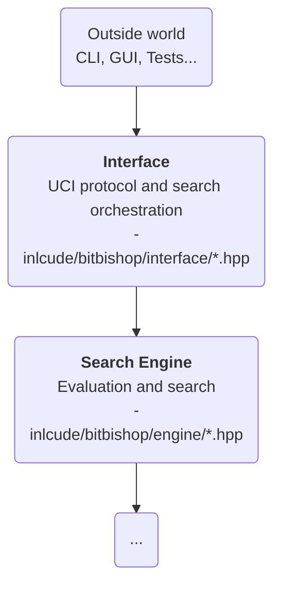
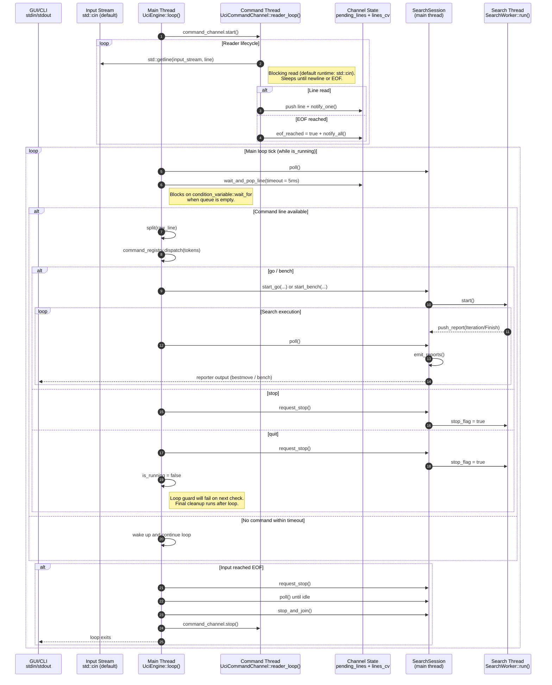
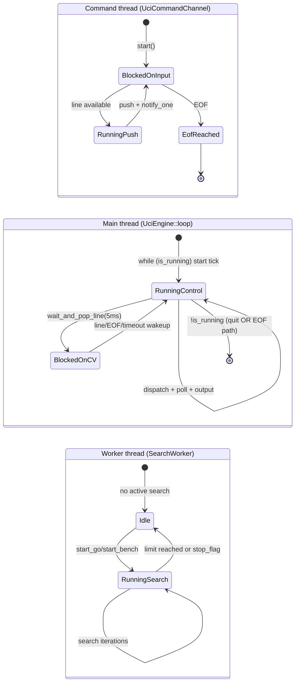
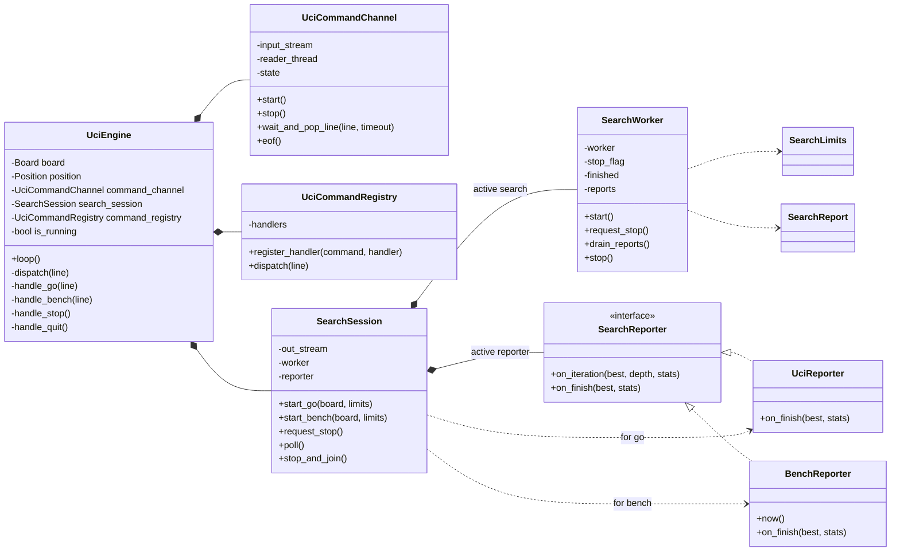

# About the `interface/` directory

## Purpose

`interface/` is the **boundary between BitBishop and the outside world**.

In the current codebase this directory is **primarily the UCI layer**.

It is responsible for:

- **Parsing external commands** and inputs
- **Translating protocol concepts into engine calls**
- **Managing search sessions**, clocks, and stop requests
- **Emiting protocol-compliant responses**

## Place in the architecture

### Thread Lifecycle (runtime)

Interface defines threading concepts in order to work with the UCI protocol.

There are currently three threads:

- The **main thread (control thread)**: parsing commands, polling search reports, and writing protocol output.
- The **listener thread** (`UciCommandChannel`) reads incoming command lines from the input stream.
- The **worker thread** (`SearchWorker`) handles best move search and currently works alone.

#### Blocking points (intentional idle time)

BitBishop does not run every thread at 100% all the time. Some waits are expected and intentional.

| Thread | Blocking call | Blocks when | Wakes up when |
| --- | --- | --- | --- |
| Command thread (`UciCommandChannel`) | `std::getline(input_stream, line)` | No full line is available (default runtime stream is `std::cin`) | Newline arrives or EOF is reached |
| Main thread (`UciEngine::loop`) | `wait_and_pop_line(..., 5ms)` (`condition_variable::wait_for`) | Pending line queue is empty and EOF not reached | A line is pushed (`notify_one`), EOF is signaled (`notify_all`), or timeout elapses |
| Worker thread (`SearchWorker`) | No intentional sleep in `run()` | It is actively searching (CPU-bound) | Search limit reached or `stop_flag` set |

#### `stop` vs `quit` semantics

| Command | Effect on search | Effect on process |
| --- | --- | --- |
| `stop` | Requests search interruption (`stop_flag = true`) and keeps the UCI loop alive | Engine keeps running and can accept new commands |
| `quit` | Requests search interruption (`stop_flag = true`) | Sets `is_running = false`, then exits loop and performs final cleanup (`stop_and_join()`, `command_channel.stop()`) |

> Note: the runtime default input is `std::cin`, but `UciEngine` accepts any `std::istream`. With pre-buffered streams (for example `std::istringstream` in tests), `std::getline` may return immediately.

> Shutdown detail: `UciCommandChannel::stop()` cannot forcibly interrupt a blocking `std::getline`, so the reader thread is detached when EOF is not yet reached.

#### Thread state timeline (runtime)

This complementary view focuses only on thread states, not message payloads.

### Class Relationships (Structure)

