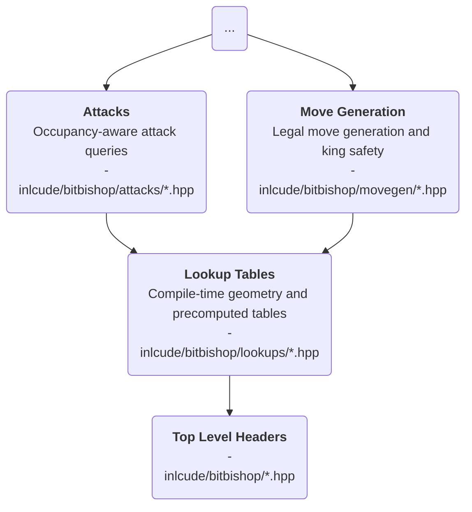

# About the `lookups/` directory

## Purpose

`lookups/` contains **compile-time geometry** and **precomputed tables**.

Code in this layer describes how pieces move on an empty board or how squares relate to one another **independently of a specific position**.

> [!NOTE]
> Some headers expose `constexpr` helper functions that build tables; that still belongs here because the results remain purely geometric and position-independent.

## Place in the architecture

## Responsibilities

- Describe **immutable board geometry**
- Precompute **local attack patterns, rays, and square relationships**
- Provide **fast, reusable primitives** for higher layers

## Inputs

- Top-level value types such as `Square`, `Bitboard`, `Color`, and board constants
- `Compile-time helpers used to build immutable tables

## Outputs

- Empty-board movement patterns
- Unblocked sliding rays
- Square-to-square geometric relations used by `attacks/` and `movegen/`

## Out of scope

- Reading `Board` state or current occupancy
- Computing exact attacks in a live position
- Enforcing chess rules, choosing moves, or speaking a protocol
