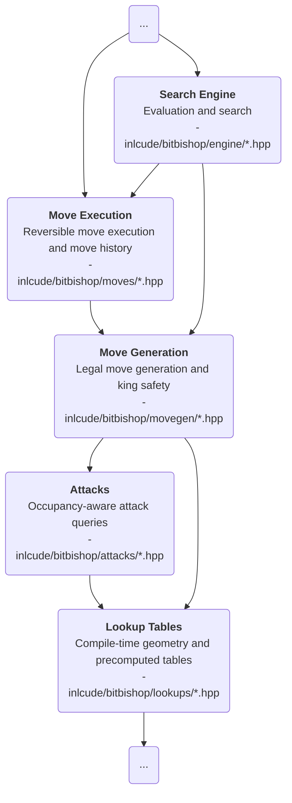

# About the `movegen/` directory

## Purpose

`movegen/` is the chess-rules layer.

It is **responsible for generating legal moves by construction** and is where **check resolution**, **pins**, **castling**, **en passant**, **promotion handling**, and **king safety** live.

## Place in the architecture

## Generation pipeline

At a high level, legal move generation works as follows:

1. Compute the active side and king square.
2. Find the checking pieces with `compute_checkers()`.
3. Compute the legal reply mask with `compute_check_mask()`.
4. Compute pinned pieces and pin rays with `compute_pins()`.
5. Build the enemy attacked-square map.
6. Generate king moves and castling moves.
7. If the king is in double check, stop there.
8. Otherwise generate legal moves for knights, bishops, rooks, queens, and pawns.

## Responsibilities

- **Generate legal moves** only
- **Enforce checks, pins, king safety, castling, en passant, and promotion rules**
- **Turn attack information into actual playable `Move`** objects

## Inputs

- `Board`, `Move`, `Color`, and other core engine types
- `attacks/` for exact attacked squares and checker detection
- `lookups/` for fixed geometry and precomputed movement templates

## Outputs

- Legal move lists consumed by search, validation tools, and other high-level code
- Rule-aware information such as check resolution and pin-constrained destinations
