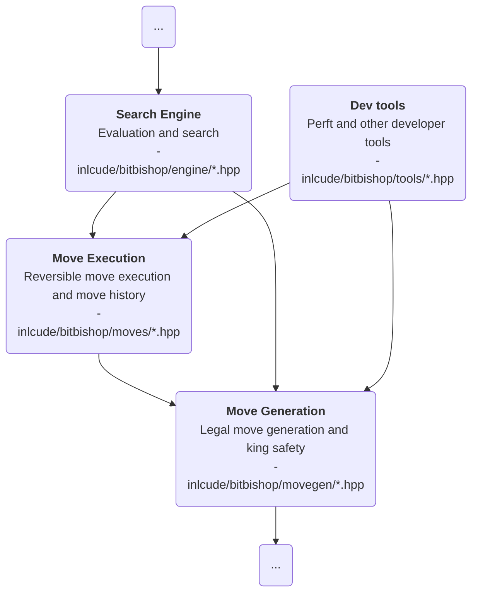

# About the `moves/` directory

## Purpose

`moves/` describes **how an already chosen `Move` changes the board** and **how to
undo that change safely**.

The boundary is:

- `movegen/` decides whether a move is legal
- `moves/` applies, records, and reverts that move

## Place in the architecture

## Responsibilities

- **Expand a chosen `Move` into low-level board effects**
- **Apply and revert those effects deterministically**
- Preserve enough **history for search rollback and repetition tracking**

## Inputs

- `Board`, `Move`, `Piece`, `Square`, and `BoardState`
- `zobrist.hpp` for repetition tracking and position identity

## Outputs

- Reversible move executions
- Search-friendly position history
- Updated board state after application or rollback
