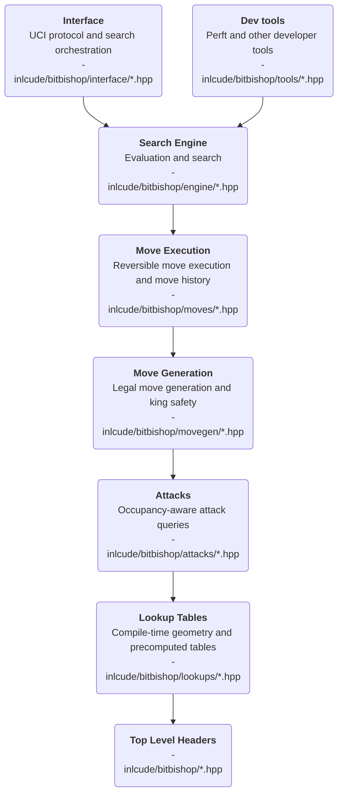

# About the `include/bitbishop/` tree

## Purpose

[`include/bitbishop`](../../include/bitbishop/) exposes the public building
blocks of the chess engine.

> [!TIP]
> [`src/bitbishop`](../../src/bitbishop/) and [`tests/bitbishop`](../../tests/bitbishop/) mirror the same architecture and contain, respectively, implementation files and tests.

## Top-level headers

> Top-level headers are intentionally documented in detail because they are stable.

### Core board model

- [`board.hpp`](board.hpp)
- [`bitboard.hpp`](bitboard.hpp)
- [`move.hpp`](move.hpp)
- [`square.hpp`](square.hpp)
- [`piece.hpp`](piece.hpp)
- [`color.hpp`](color.hpp)

### Shared engine data

- [`constants.hpp`](constants.hpp)
- [`bitmasks.hpp`](bitmasks.hpp)
- [`config.hpp`](config.hpp)
- [`random.hpp`](random.hpp)
- [`zobrist.hpp`](zobrist.hpp)

## Directory guide

include/bitbishop/\
├── [attacks](attacks/readme.md) - Occupancy-aware attack queries\
├── [engine](engine/readme.md) - Evaluation and search\
├── [interface](interface/readme.md) - UCI protocol and search orchestration\
├── [lookups](lookups/readme.md) - Compile-time geometry and precomputed tables\
├── [movegen](movegen/readme.md) - Legal move generation and king safety\
├── [moves](moves/readme.md) - Reversible move execution and move history\
└── [tools](tools/readme.md) - Perft and other developer tools

## Layering

> [!NOTE] The arrows below represent the usual flow of information between layers, not necessarily every direct include dependency.

## Dependency rule of thumb

- If code is position-independent geometry, it belongs in `lookups/`.
- If it needs occupancy but not legal-move filtering, it belongs in `attacks/`.
- If it decides which moves are legal, it belongs in `movegen/`.
- If it applies or reverts a chosen move, it belongs in `moves/`.
- If it evaluates or selects moves, it belongs in `engine/`.
- If it talks to a GUI, CLI, or protocol, it belongs in `interface/`.
- If it exists mainly to validate or debug the engine, it belongs in `tools/`.
