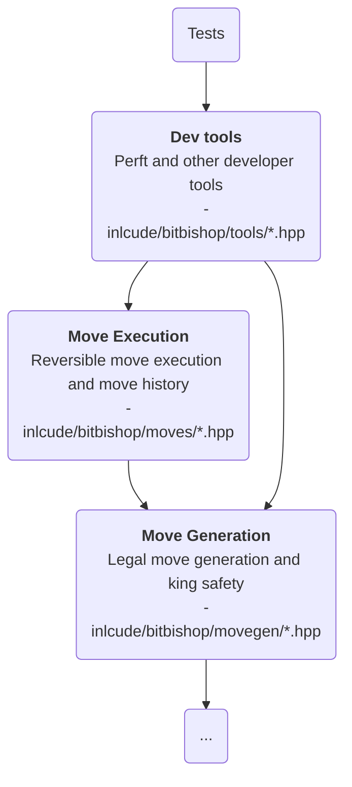

# About the `tools/` directory

## Purpose

`tools/` contains **developer-facing verification and debugging helpers**.

These utilities **sit beside the engine** rather than inside the main move-choice
pipeline. They are useful **for validating correctness** and measuring internal
behaviour.

## Place in the architecture

## Responsibilities

- **Validate the correctness of the rules stack**
- provide **debugging and benchmarking helpers for developers**
- surface information that is **useful during implementation and testing**

## Inputs

- `Board`
- The move-generation and move-application stack used by perft internally

## Outputs

- Diagnostic counts, reports, and validation signals
- Tooling support for manual debugging and regression checks
